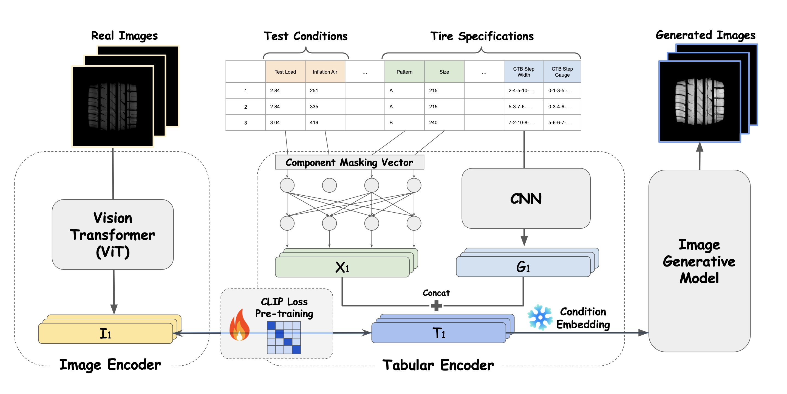

# CTIP: Towards Accurate Tabular-to-Image Generation for Tire Footprint Generation

The implementation codes of the paper "CTIP: Towards Accurate Tabular-to-Image Generation for Tire Footprint Generation"

## Overview

<!-- figure -->


Despite significant advancements in image generative models, their direct applicability to industry, particularly in manufacturing, remains limited. Existing approaches often overlook the unique challenges posed by tabular data, a prevalent format in industrial settings. In this work, Tabular-to-Image method is introduced, which aims to generate target images from tabular inputs, addressing the limitations in current research. Our approach, which utilizes Contrastive Tabular-Image Pre-Training (CTIP), shows improved image quality and adaptability for both Generative Adversarial Networks (GAN)-based and diffusion-based models. Through experiments with real-world manufacturing data, this work presents the effectiveness of CTIP, especially in scenarios with limited tabular features, called feature few-shot or feature zero-shot. Our work not only offers a practical solution for image generation in industry but also emphasizes the significance of considering tabular data in generative modeling research.

## Installation
To install the necessary dependencies, please follow these steps:

1. Clone the repository:
    ```sh
    git clone https://github.com/{todo}/CTIP.git
    cd CTIP
    ```

2. Create a virtual environment and activate it:
    ```sh
    python3 -m venv venv
    source venv/bin/activate
    ```

3. Install the required packages:
    ```sh
    pip install -r requirements.txt
    ```

## Usage
To use the CTIP model, follow these steps:

1. Prepare your dataset in the required format.

    We don't provide the code for the data loader because it leaks feature names, etc. from the data, but you can use it in your own data by making categorical variables into one-hot vectors and normalizing numeric variables to match your data. We also used graphical variables, but if you don't use them, just exclude variables with the keyword gauge in them.

2. (Optional) Convert the ground truth image to latent vector form.
    
    To speed up the training of the latent diffusion model, you can create ground truth images as latent vectors in advance to reduce the time it takes to load the images and create them as latent vectors using VAE during the training process.
    ```sh
    cd data
    python make_latent.py
    ```
3. You can modify the parameters of your model in main.py and config.yml. 
4. Run the training script:
    ```sh
    python3 main.py 
    ```

## Experiment
Unfortunately, data security does not allow us to disclose the Dataset we used, so we exclude the code related to the Dataset. However, you should be able to use it if you configure a properly formatted Dataset and Dataloader.
