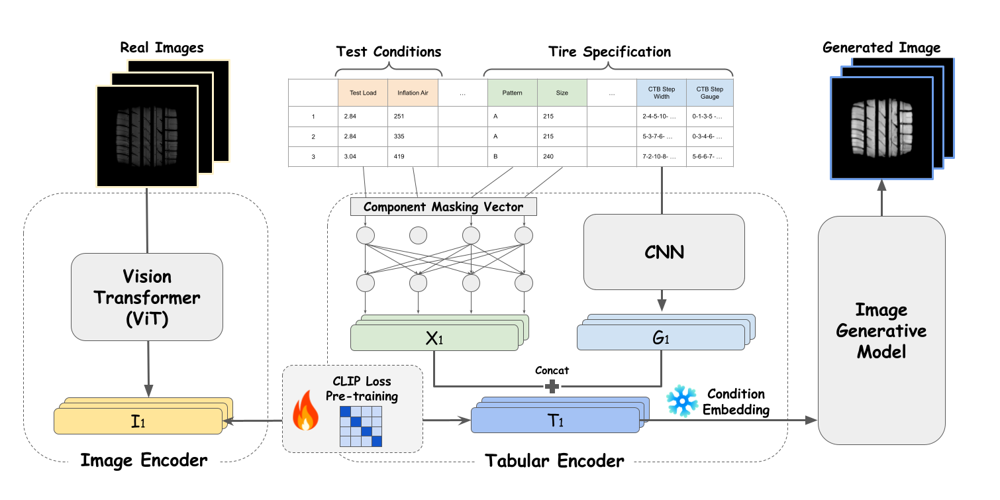

# CTIP
CTIP: Towards Accurate Tabular‑to‑Image Generation

# Overview

<!--  -->

Despite significant advancements in image generative models, their direct applicability to industry, particularly in manufacturing, remains limited. Existing approaches often overlook the unique challenges posed by tabular data, a prevalent format in industrial settings. In this work, Tabular-to-Image method is introduced, which aims to generate target images from tabular inputs, addressing the limitations  in current research. Our approach, which utilizes Contrastive Tabular-Image Pre-Training (CTIP), shows improved image quality and adaptability for both Generative Adversarial Networks (GAN)-based and diffusion-based models. Through experiments with real-world manufacturing data, this work presents the effectiveness of CTIP, especially in scenarios with limited tabular features, called feature few-shot or feature zero-shot. Our work not only offers a practical solution for image generation in industry but also emphasizes the significance of considering tabular data in generative modeling research.
 

# Experiment
Unfortunately, data security does not allow us to disclose the Dataset we used, so we exclude the code related to the Dataset. However, you should be able to use it if you configure a properly formatted Dataset and Dataloader.  

 